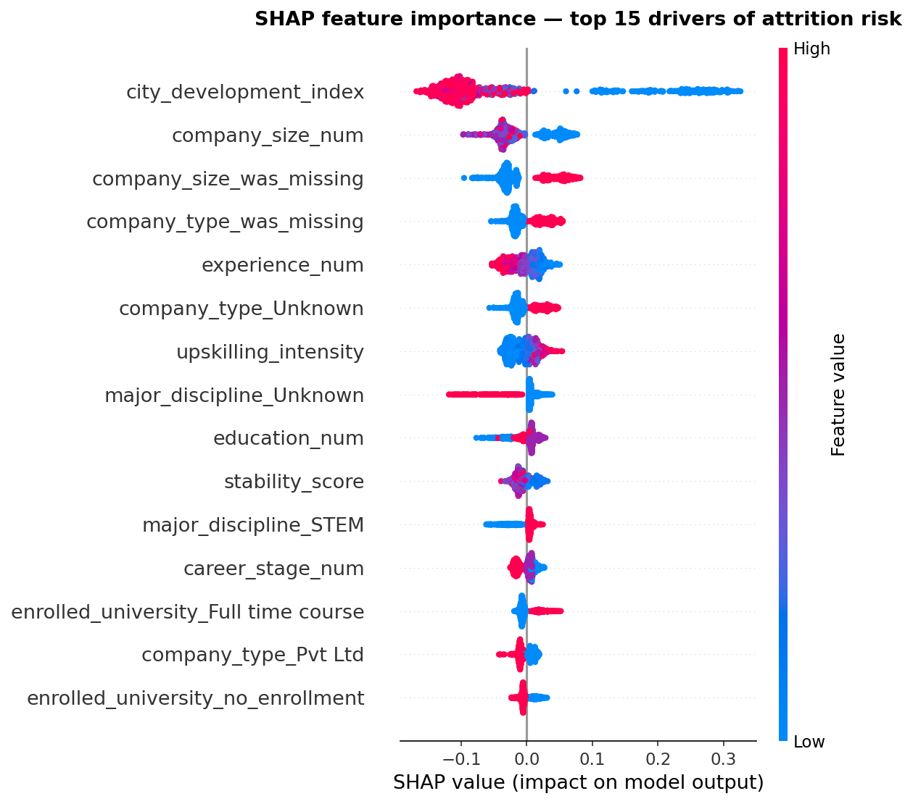
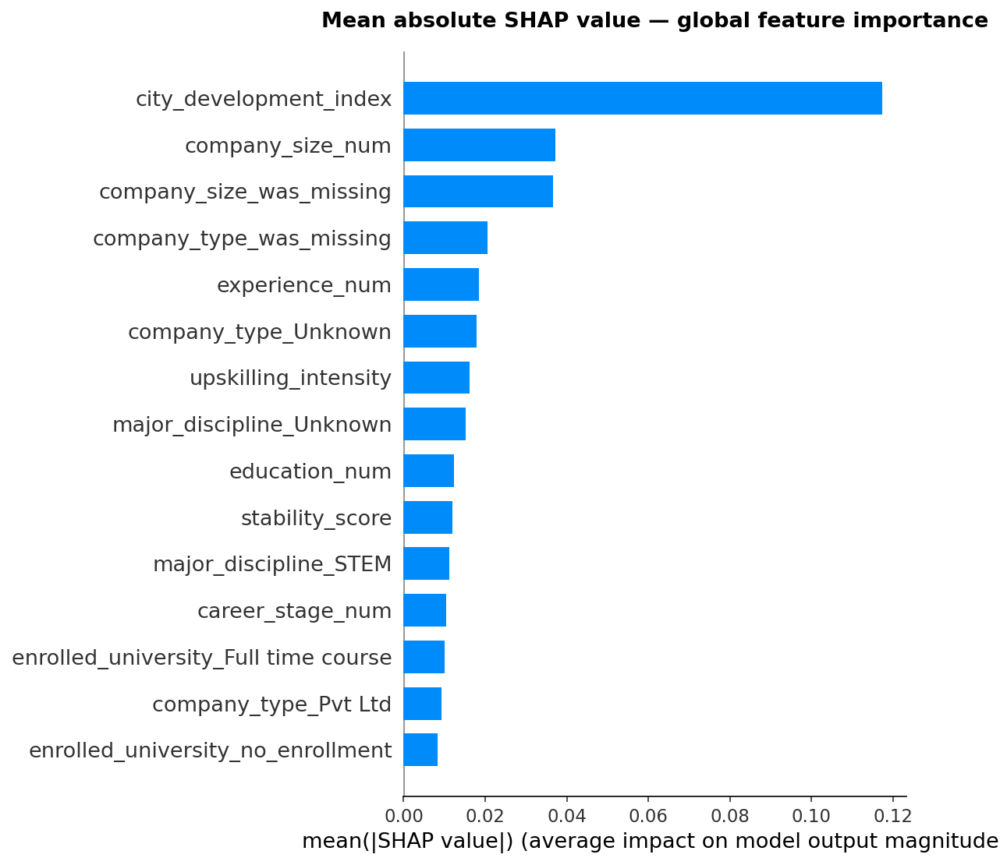

# HR Analytics - Attrition Risk Report

**Prepared by:** Kerim Omarov
**Dataset:** 19,158 data science professionals (Kaggle - Arashnic)
**Model:** Random Forest Classifier (tuned via RandomizedSearchCV)

---

## Executive Summary

A machine learning model trained on 19,158 records of data science professionals identifies five key drivers of employee attrition risk. The model achieves an **AUC-ROC of 0.81** on held-out data, meaning it correctly ranks a job-seeker above a non-seeker **81%** of the time - well above the 0.50 chance baseline and a 62% improvement over a naive majority-class predictor.

The analysis segments the workforce into three actionable risk tiers:

| Risk Tier | Threshold | Recommended Action |
|---|---|---|
| **High Risk** | prob ≥ 0.60 | Immediate retention intervention |
| **Medium Risk** | 0.35–0.60 | Targeted development programs |
| **Low Risk** | < 0.35 | Standard engagement |

---

## Key Findings

### 1. City of origin is the strongest attrition signal

Employees from cities with a development index (CDI) below 0.70 are approximately **1.9× more likely** to seek a job change than those in high-development cities (CDI > 0.90). The median CDI for job-seekers is 0.74 vs. 0.91 for non-seekers - a meaningful and consistent gap confirmed by both EDA and SHAP analysis. Limited local market opportunity drives candidates toward external options - remote roles, relocation, or higher-paying markets.

**Recommendation:** Adjust retention incentives for employees hired from lower-CDI markets. Specifically: competitive remote-work access, relocation support, and compensation benchmarked against the target market (not the candidate's home city).

---

### 2. The 2–4 year mark is the peak flight-risk window

Attrition intent peaks at 1–4 years of experience, with the highest rates at the <1 year (45%) and 1-year (42%) marks, and declines steadily from year 5 onward. By 15+ years, seeking rate drops below 18%. This is the classic post-onboarding mobility window - employees have built enough skill to be attractive externally but have not yet developed deep organizational ties.

**Recommendation:** Implement structured career conversations at the **18-month** and **30-month** marks. These are the highest-leverage intervention points. Ask: Is this person on a visible growth path? Do they have a mentor? Is their compensation aligned with market rate?

---

### 3. Company size is a proxy for stability

Employees from organizations with fewer than 50 staff show attrition rates above **35%**, compared to under **20%** at enterprises of 10,000+. The Unknown group - likely freelancers and contractors - shows the highest rate of all at ~41%. When recruiting from small companies, plan for a shorter expected average tenure.

**Recommendation:** When onboarding candidates who come from very small companies, invest earlier and more explicitly in organizational belonging - team integration, visible career ladders, and explicit stability signals.

---

### 4. Training hours do not predict attrition (r ≈ 0.01)

The correlation between training investment and job-seeking intent is virtually zero (r = 0.01), confirmed by both the scatter plot and the correlation heatmap. Upskilling programs alone are **not** a retention tool - the structural factors (location, company size, career stage) dominate completely. This challenges the common HR assumption that investing in training reduces turnover.

**Implication:** Training budgets should be justified on skill-building and capability grounds, not on retention grounds. Do not use training completion rates as a proxy for retention health.

---

### 5. Missing company data is itself a risk signal

Candidates who did not report their company type show a seeking rate of approximately **39%** and those missing company size show **41%**, compared to ~18% among those who reported. This group likely includes freelancers, contractors, and consultants who are structurally more mobile. Missingness is not random - it is a meaningful feature in its own right, captured via binary indicator flags in the model.

**Recommendation:** When recruiting candidates who cannot or do not report a current employer, apply elevated retention effort during the first 12 months. These candidates may have a transactional relationship with employment by default.

---

## Model Performance Summary

| Model | AUC-ROC | F1 (seekers) | Notes |
|---|---|---|---|
| Dummy (baseline) | 0.50 | 0.00 | Predicts majority class only |
| Logistic Regression | 0.79 | 0.59 | Interpretable baseline |
| Random Forest | 0.81 | 0.63 | Default hyperparameters |
| **RF Tuned (final)** | **0.81** | **0.64** | RandomizedSearchCV, 20 iterations |

*Evaluated on a stratified 20% hold-out set (3,832 rows). Primary metric: AUC-ROC (chosen for robustness to class imbalance). Raw accuracy is not reported - misleading on a 75/25 imbalanced dataset.*

**Optimal classification threshold:** 0.536 (vs. default 0.50). At this threshold: Precision = 0.56, Recall = 0.77, F1 = 0.65. Shifting from the default threshold raises recall by ~2 points - appropriate for an HR retention use case where missing a true job-seeker (false negative) is more costly than a false alarm.

---

## Top Attrition Risk Drivers (SHAP)

The chart below shows the top 15 features by average impact on model predictions. Features with blue dots on the right side of zero indicate that **low values** of that feature push the model toward predicting job-seeking. Red dots on the right indicate **high values** increase risk.





**Top confirmed drivers:**

1. **`city_development_index`** - dominant by a wide margin (SHAP ~0.12 vs. ~0.04 for #2). Low CDI strongly pushes toward job-seeking, confirming the EDA finding.

2. **`company_size_num`** - raw company size ordinal. Smaller company = higher risk.

3. **`company_size_was_missing`** - the indicator flag for missing company size. Directly validates the preprocessing decision to capture missingness as a feature. Candidates without company size data are structurally higher risk.

4. **`company_type_was_missing`** Missing company type is itself a strong attrition signal, likely identifying freelancers and contractors.

5. **`experience_num`** - early career stage increases risk and senior reduces it.


All four engineered features (#7 - `upskilling_intensity`, #10 - `stability_score`, #12 - `career_stage_num`) appear in the top 15, confirming they added genuine predictive signal beyond the raw inputs.

---

## Recommended Actions by Risk Tier

| Tier | Typical Profile | Recommended HR Action |
|---|---|---|
| **High Risk** | Low CDI, <4 yrs exp, small company background | Manager check-in within 30 days; salary review; explicit growth roadmap conversation |
| **Medium Risk** | Mid CDI, 5–10 yrs, mixed company type | Quarterly development conversations; skills investment offer; team belonging signals |
| **Low Risk** | High CDI, 10+ yrs, large company background | Standard engagement; periodic pulse surveys; no immediate action required |

---

## Limitations

- **Self-selection bias:** The dataset comes from a training platform. Respondents are already upskilling, which is itself an attrition signal. Findings may not generalize to passive employees or non-technical roles.
- **Correlation, not causation:** The model identifies correlates of attrition intent, not causes. Intervening on a correlated factor may not change the underlying outcome.
- **Point-in-time snapshot:** The dataset reflects a specific period. Attrition patterns shift with labor market conditions - post-pandemic remote work normalization, for example, changes the role of CDI as a constraint.
- **Class imbalance:** Despite `class_weight='balanced'`, precision on the high-risk tier is limited (0.56). The cost of false negatives (missed at-risk employees) should guide threshold selection for each organization's context.
- **Feature encoding:** Nominal features encoded via LabelEncoder in the correlation heatmap may not reflect true ordinal relationships. Pearson correlations on label-encoded categoricals should be interpreted directionally, not as precise effect sizes.

---

## Methodology Summary

```
Data Inspection → SQL Analysis → EDA → Preprocessing → Modeling → Explainability
```

| Phase | Tool | Key Output |
|---|---|---|
| Data inspection | pandas | Quality report, missing value audit, missingness-vs-target analysis |
| SQL analysis | DuckDB | 12 business queries - RANK, window functions, two-stage CTEs, QUALIFY |
| EDA | matplotlib, seaborn | 11 annotated charts, 5 business insights |
| Preprocessing | pandas, sklearn | Ordinal encoding, imputation, 3 engineered features, leakage-safe alignment |
| Modeling | scikit-learn | RF tuned via RandomizedSearchCV, AUC-ROC 0.81, threshold tuning at 0.536 |
| Explainability | SHAP | Beeswarm, bar, and dependence plots - top feature: city_development_index |
